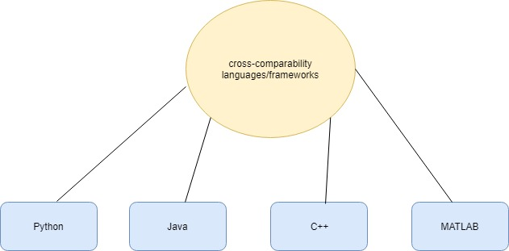
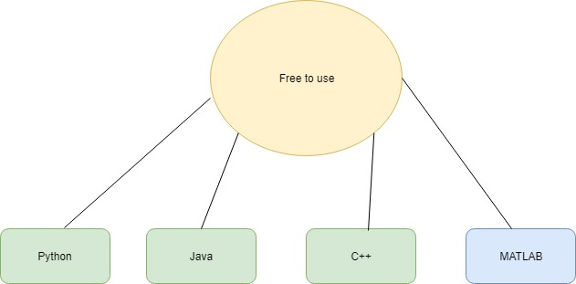
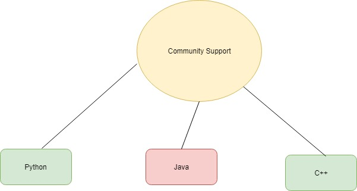
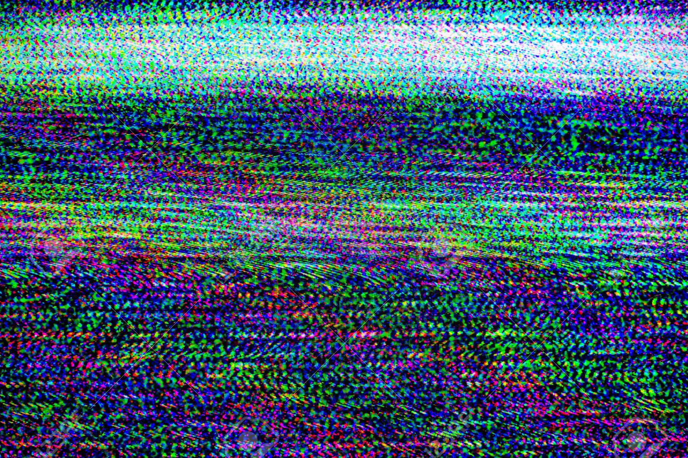
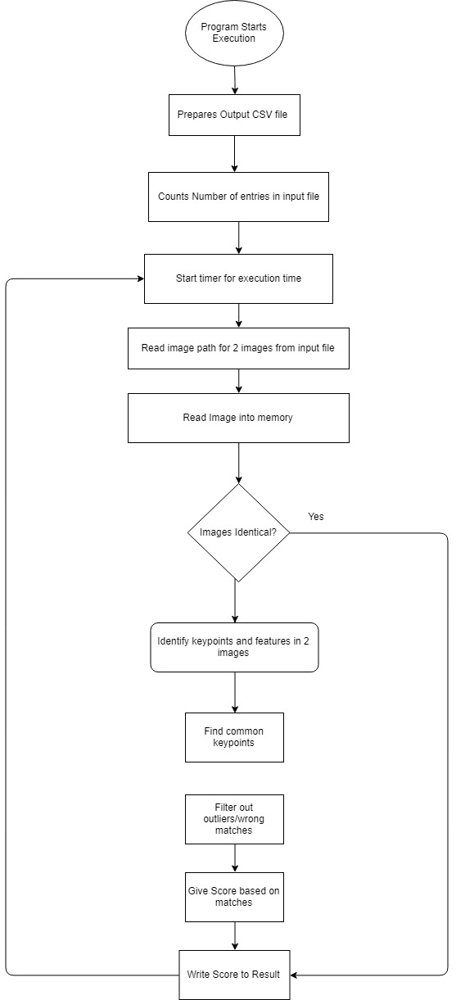
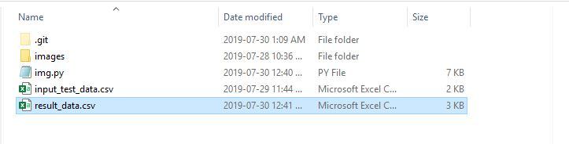
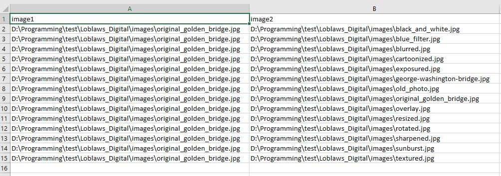
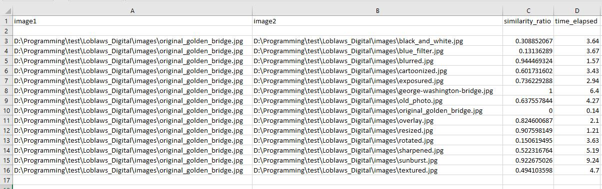

# Loblaws Digital - Developer Take Home Assignment - Ranking Images Based on Similarity

## Table of Contents

* [Introduction](https://github.com/p6arora/LoblawsDigital_ImageComparison#Introduction)
* [Design](https://github.com/p6arora/LoblawsDigital_ImageComparison#Design)
* [Implementation](https://github.com/p6arora/LoblawsDigital_ImageComparison#Implementation)
* [Setup](https://github.com/p6arora/LoblawsDigital_ImageComparison#Setup)
* [Usage](https://github.com/p6arora/LoblawsDigital_ImageComparison#Usage)
* [Tests](https://github.com/p6arora/LoblawsDigital_ImageComparison#Tests)
* [Author](https://github.com/p6arora/LoblawsDigital_ImageComparison#Author)

## Introduction

For this assignment, my objective was to make a tool which compared 2 images for similarity and rank them accordingly. It was an open-ended assignment and I had the option to choose whichever stack I would deem the best option. My prefered stack was:

* Python
* OpenCV

The justifications for my design and alternative design are explored in the Design subsection

## Design

In order to understand the decision making, let's review requirements:

* Bjorn would like to run the program on his windows and MacOS machine - needs *cross comparability*
* Jeanie needs the program to be cost effective - should probably use a *free to use language/framework*
* Ferris will be maintaning the application - needs to be*large amounts of community support* if problems arise



Based on my research, Java, C++, Python and MATLAB were the best options for image processing. These also are all cross compatable through Java running on the JVM, C++ compiler being natively available in UNIX and through Cygwin on Windows, as well as MATLAB being used extensively in academic work. Python also is an excellent choice for it's cross platform support and ease of use



All languages except MATLAB are free to use and can be used for this purpose



In the case of large online communities able to ask questions and provide support, C++ and Python are very well known for their OpenCV library and have a large amount of help

Between these two languages, Python was deemed the easiest to setup for cros-compatability purposes and ease of use.

In terms of different avenues on how to solve the problems, there were Content Based Image Retrievel Systems which rank similarity based on Euclidean distance, Manhatten distance, and Histogram Intersection distance. However, based on my expereince, evaluating similarity based on the respective color bins isn't the most acurate as many pictures can have the same RGB values but the organization would be much different. This doesn't make them similar. For example, these 2 images have similar RGB values but different organization 




I feel using a feature tracking algorithm such as SIFT, ORB, BRISK, etc would provide the most acurate results. It would be able to detect the portion of the image that match similar identifiers in images. Based on my trial and research, SIFT produced acurate results while not being too much of a drag on performance


## Implementation



As shown above, the program starts with preparing the output CSV file, which entails creating a CSV file and placing the respective column names of image1, image2, similarity, time_elapsed

This is followed by counting the number of entries in the input CSV file and then iterating through each row, extracting the location of the images and reading it into memory

It does a preliminary check of the RGB values to see if they're exactly identical and in the same size and channels. If they are, it calculates time elapsed and provides a score of 0 for the two images and writies to the result file

If the images don't appear to be identical, the SIFT algirthm is initialized to find edges, vertices in the image it can associate as keypoints. It then removes outliers and mismatches from the algorithm by setting a max ratio the distance where 2 points which were linked can apart. 

Based on the volume of correct matches and total matches observed, a similarity ratio is created and written to the result CSV file along with time elapsed


## Setup

Python is required for this tool, and Real Python's blog post is a great tool to setup your environment on MacOS or Windows:

[Python Setup](https://realpython.com/installing-python/)

At the time of the assignment, I was using Python 3.7 and the newest OpenCV version was 4.1.0.25. **However**, in order to use the SIFT Algorithm, 2 older versions of the OpenCV libraries were needed. These can be installed using pip:

```bash
pip3 install opencv-python==3.4.2.17 opencv-contrib-python==3.4.2.17
```
In order to measure execution time and read/write from CSV files, time and csv libraries were used but these are available built in to Python. Your final imports should appear as:

```python
import cv2
import csv
import time

```

## Usage

This tool can be accessed by cloning or downloading as a ZIP file to your workstation from GitHub directly. In order to start using the tool with your own CSV file, simply remove the "input_test_data.csv" under the ```read_data()``` function with your own CSV file. For your convienience, the code snippet is shown below:

```python
#read from CSV file
def read_data():
    print("starting to read data")
    with open('input_test_data.csv') as input_data:
        print("opened data file")
        global line_count
        csv_reader = csv.reader(input_data, delimiter=',')
        set_of_images=[row for idx, row in enumerate(csv_reader) if idx == line_count]
        print(set_of_images)
        original_image = set_of_images[0][0]
        image_to_compare = set_of_images[0][1]
        line_count += 1
        return [original_image, image_to_compare]
```
and replace it with your data file here:

```python
#read from CSV file
def read_data():
    print("starting to read data")
    with open('DATA FILE HERE.csv') as input_data:
        print("opened data file")
        global line_count
        csv_reader = csv.reader(input_data, delimiter=',')
        set_of_images=[row for idx, row in enumerate(csv_reader) if idx == line_count]
        print(set_of_images)
        original_image = set_of_images[0][0]
        image_to_compare = set_of_images[0][1]
        line_count += 1
        return [original_image, image_to_compare]
```

Ensure that the CSV file has the absolute path for each image you wish to compare

The result CSV file will appear in the same drive as the img.py file



## Tests

As per the assignment, the tool would be able to read a CSV file with the format:

| Image1        | Image2           | 
| ------------- |:----------------:| 

The output file would have to have a format of:

| Image1        | Image2   | Similarity | Time Elapsed |
| ------------- |:--------:| :--------: | :------------|


In order to verify this tool was working as intended, I created a sample CSV file with modified images of the golden gate bridge. The file called ```input_test_data.csv``` appears as follows:



The ```result_data.csv``` based on the input is this:



As per requirement in the assignment, the similairity is ranked from 0 - 1, where 0 means it is an identical image and 1 means very different.

The ```input_test_data.csv``` and ```result_data.csv``` are included in the repository can be used as a template

## Author

Paarth Arora

Bachelors of Computer Engineering, Ryerson University


